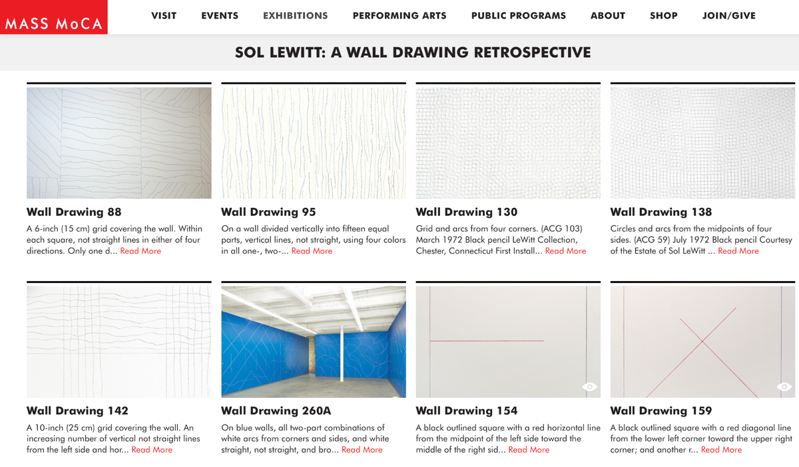
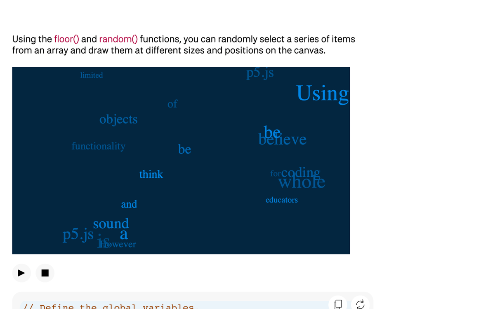
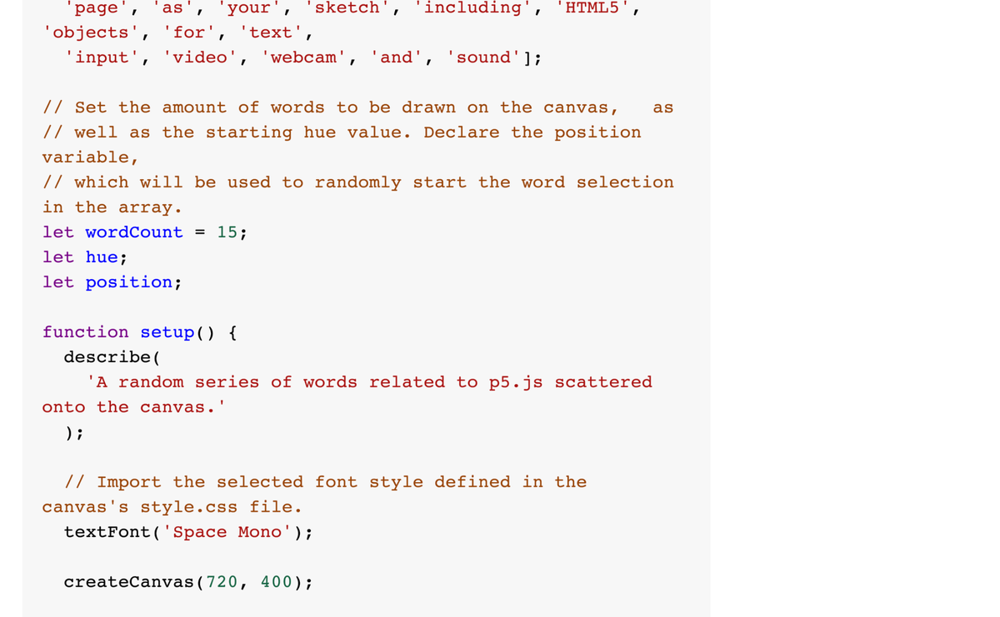
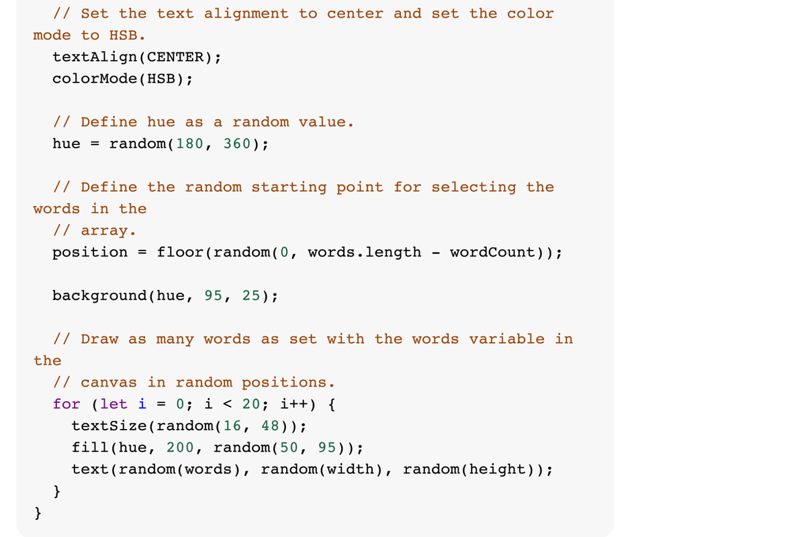

### Part 1

I was inspired by Sol LeWitt’s wall drawings, where he wrote instructions for other artists to execute.  
This approach is similar to programming, where we use learned techniques to generate works based on instructions.  
By introducing random generation within constraints, we can create unique designs.  
I believe this method will play a significant role in our future projects.

---

### Part 2

Both p5.js sketches use randomization and HSB color mode to create varied visual compositions.  
The `colorMode(HSB)` separates hue, saturation, and brightness, allowing independent adjustments for precise color control.  
The `random()` function introduces variability in parameters like positions, sizes, and angles, ensuring unique results while maintaining the core structure.  
Although the examples are in text form, we can still find similarities in the code.  
By experimenting with it, we can achieve the desired variations and effects.

  
  

---

### 🔗 Example Code Reference

[Random Poetry with Arrays – p5.js Example](https://p5js.org/examples/listing-data-with-arrays-random-poetry/)

